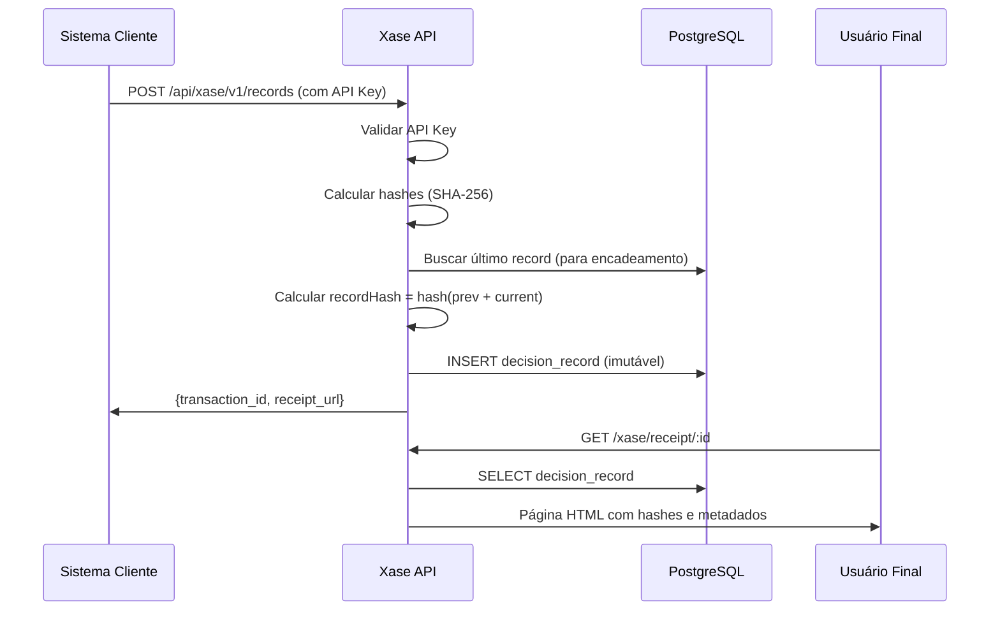

# 🎯 XASE CORE - Immutable Decision Ledger

## 📋 Visão Geral

O **Xase Core** foi integrado ao seu sistema existente de forma **não-destrutiva**. Todos os seus modelos, autenticação, pagamentos e funcionalidades WhatsApp/IA permanecem intactos.

### O que foi adicionado:

✅ **3 novas tabelas** (prefixo `xase_`):
- `xase_tenants` - Empresas clientes do Xase
- `xase_api_keys` - Autenticação para ingestão de decisões
- `xase_decision_records` - Ledger imutável de decisões de IA

✅ **2 novos campos no User**:
- `tenantId` - Link opcional para Tenant do Xase
- `xaseRole` - Papel no Xase (OWNER, ADMIN, VIEWER)

✅ **APIs REST completas**:
- `POST /api/xase/v1/records` - Criar decisão
- `GET /api/xase/v1/verify/:id` - Verificar integridade
- `GET /xase/receipt/:id` - Recibo público

---

## 🚀 Setup Rápido

### 1. Executar Migration

```bash
npm run xase:setup
```

Isso vai:
- Criar as 3 tabelas do Xase no PostgreSQL
- Adicionar colunas ao User
- Gerar Prisma Client atualizado

### 2. Criar Primeiro Tenant

```bash
npm run xase:tenant "Acme Corp" "tech@acme.com" "Acme Corporation"
```

Você receberá:
- **Tenant ID**
- **API Key** (guarde com segurança!)

### 3. Testar API

```bash
curl -X POST http://localhost:3000/api/xase/v1/records \
  -H "Content-Type: application/json" \
  -H "X-API-Key: xase_pk_..." \
  -d '{
    "input": {"user_id": "12345", "loan_amount": 50000},
    "output": {"decision": "APPROVED", "interest_rate": 4.5},
    "policyId": "loan-approval-v2",
    "policyVersion": "2.1.0",
    "decisionType": "loan_approval",
    "confidence": 0.95,
    "storePayload": true
  }'
```

Resposta:
```json
{
  "success": true,
  "transaction_id": "txn_a1b2c3...",
  "receipt_url": "http://localhost:3000/xase/receipt/txn_a1b2c3...",
  "timestamp": "2025-12-15T14:30:00.000Z",
  "record_hash": "abc123...",
  "chain_position": "genesis"
}
```

### 4. Ver Recibo Público

Acesse a URL do recibo no navegador:
```
http://localhost:3000/xase/receipt/txn_a1b2c3...
```

---

## 📁 Estrutura de Arquivos Criados

```
prisma/
  schema.prisma          # ✅ Atualizado (modelos Xase adicionados)

database/
  xase-core-migration.sql   # Migration SQL
  run-migration.js          # Executor de migration
  create-tenant.js          # Criar tenants

src/
  lib/
    xase/
      crypto.ts          # Funções de hash e encadeamento
      auth.ts            # Validação de API Key
  
  app/
    api/
      xase/
        v1/
          records/
            route.ts     # POST criar decisão, GET health
          verify/
            [id]/
              route.ts   # GET verificar integridade
    
    xase/
      receipt/
        [id]/
          page.tsx       # Página pública de recibo
```

---

## 🔑 Autenticação

### API Key (para ingestão de decisões)

Usado por sistemas externos para registrar decisões:

```typescript
headers: {
  'X-API-Key': 'xase_pk_...'
}
```

### NextAuth (para console - futuro)

Usuários do seu sistema podem acessar o console Xase se tiverem `tenantId` configurado:

```typescript
// Vincular User ao Tenant
await prisma.user.update({
  where: { id: userId },
  data: {
    tenantId: 'tenant_id_aqui',
    xaseRole: 'OWNER' // ou ADMIN, VIEWER
  }
});
```

---

## 🔐 Segurança

### Imutabilidade do Ledger

As decisões **não podem ser alteradas ou deletadas** após criação:

- ✅ Triggers PostgreSQL impedem UPDATE/DELETE
- ✅ Hash encadeado detecta qualquer adulteração
- ✅ Cada decisão referencia a anterior (blockchain-like)

### Rate Limiting

- **1000 requests/hora** por API Key (configurável)
- Implementação básica em memória
- TODO: Migrar para Redis em produção

---

## 📊 Schema do Banco

### Tenant
```prisma
model Tenant {
  id              String
  name            String
  email           String @unique
  companyName     String?
  status          TenantStatus  // ACTIVE, SUSPENDED, CANCELLED
  plan            String        // free, pro, enterprise
  
  users           User[]        // Usuários com acesso
  apiKeys         ApiKey[]
  decisionRecords DecisionRecord[]
}
```

### ApiKey
```prisma
model ApiKey {
  id          String
  tenantId    String
  name        String
  keyHash     String @unique  // bcrypt hash
  keyPrefix   String          // primeiros 16 chars
  isActive    Boolean
  rateLimit   Int             // requests/hora
  lastUsedAt  DateTime?
}
```

### DecisionRecord
```prisma
model DecisionRecord {
  id              String
  tenantId        String
  transactionId   String @unique  // ID público
  
  // Hashes criptográficos
  inputHash       String
  outputHash      String
  contextHash     String?
  recordHash      String @unique  // Hash encadeado
  previousHash    String?         // Link para anterior
  
  // Metadata
  policyId        String?
  policyVersion   String?
  decisionType    String?
  confidence      Float?
  
  // Payloads opcionais
  inputPayload    String?
  outputPayload   String?
  contextPayload  String?
  
  timestamp       DateTime
}
```

---

## 🧪 Testes

### Health Check
```bash
curl http://localhost:3000/api/xase/v1/records
```

### Criar Decisão
```bash
curl -X POST http://localhost:3000/api/xase/v1/records \
  -H "Content-Type: application/json" \
  -H "X-API-Key: xase_pk_..." \
  -d '{"input":{"test":"data"},"output":{"result":"ok"}}'
```

### Verificar Integridade
```bash
curl http://localhost:3000/api/xase/v1/verify/txn_a1b2c3...
```

---

## 🎨 Recibo Público

O recibo público (`/xase/receipt/:id`) mostra:

✅ Transaction ID
✅ Timestamp
✅ Policy/Model info
✅ Hashes criptográficos
✅ Status de verificação
✅ Aviso legal
✅ Empresa emissora

**Importante**: O recibo público **não mostra** os payloads (input/output), apenas os hashes. Para ver os payloads, o usuário precisa estar autenticado no console (futuro).

---

## 🔄 Fluxo Completo



---

## 📈 Próximos Passos (Roadmap)

### Fase 1 - MVP (Atual) ✅
- [x] Schema do banco
- [x] Migration SQL
- [x] API de ingestão
- [x] API de verificação
- [x] Recibo público
- [x] Hash chaining
- [x] Triggers de imutabilidade

### Fase 2 - Console Privado
- [ ] `/xase/console` - Dashboard
- [ ] `/xase/console/records` - Listagem
- [ ] `/xase/console/records/:id` - Detalhe com payloads
- [ ] Autenticação via NextAuth
- [ ] Controle de acesso por role (OWNER/ADMIN/VIEWER)

### Fase 3 - Features Avançadas
- [ ] Exportar pacote de prova (ZIP)
- [ ] Storage S3/R2 para payloads grandes
- [ ] Busca e filtros
- [ ] Webhooks
- [ ] SDK Node.js e Python
- [ ] Rate limiting com Redis

### Fase 4 - Enterprise
- [ ] Multi-tenancy avançado
- [ ] Billing e planos
- [ ] Compliance reports (GDPR, SOC2)
- [ ] Auditoria avançada
- [ ] API de analytics

---

## ⚠️ Importante

### O que NÃO foi alterado:
- ✅ Autenticação NextAuth (User, Account, Session)
- ✅ Pagamentos Stripe (Plan, Price, Subscription)
- ✅ WhatsApp (todas as tabelas)
- ✅ IA Agent (todas as tabelas)
- ✅ Qualquer outra funcionalidade existente

### O que foi adicionado:
- ✅ 3 tabelas novas (prefixo `xase_`)
- ✅ 2 colunas opcionais no User
- ✅ APIs REST em `/api/xase/*`
- ✅ Páginas em `/xase/*`

**Tudo coexiste perfeitamente!**

---

## 🆘 Troubleshooting

### Erro: "Property 'tenant' does not exist"
```bash
npx prisma generate
```

### Erro: "Table xase_tenants does not exist"
```bash
npm run xase:migrate
```

### Erro: "Invalid API key"
Verifique se está usando a key completa gerada pelo `create-tenant.js`

### Migration falha
Verifique se o `DATABASE_URL` está correto no `.env`

---

## 📞 Suporte

Para dúvidas ou problemas:
1. Verifique este README
2. Verifique os logs do console
3. Verifique o banco de dados diretamente

---

**Desenvolvido com ❤️ para eliminar ansiedade jurídica em decisões de IA**
